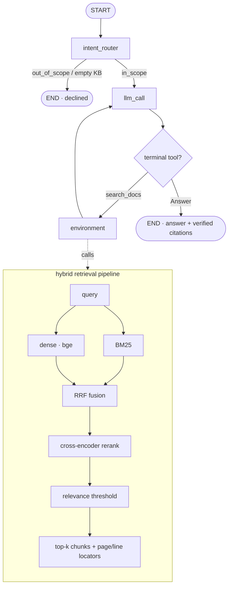

# citelocal-agent — chat with your papers, fully local

[中文](README.md) | **English**

Ask questions across a pile of papers (or any local docs) and get answers with
**page-precise, verified citations** — running **entirely on your machine**. Built
on [LangGraph](https://langchain-ai.github.io/langgraph/).

Cloud paper tools (ChatPDF, Elicit, …) make you **upload your PDFs**. citelocal-agent
doesn't: embeddings run locally, papers never leave your disk (`papers/` is
gitignored), and you can even run the answer model locally via Ollama. What you
get back is grounded — every citation is checked against what was actually
retrieved, down to the **PDF page**.

## Why it's different

- 🔒 **Fully local / private** — your PDFs are never uploaded; local embeddings,
  optional local LLM (Ollama). Good for unpublished or sensitive papers.
- 📎 **Page-precise, verified citations** — answers cite `paper.pdf (p.3)`; cited
  locators are **checked against retrieval**, hallucinated ones are dropped.
- 🔗 **Cross-paper synthesis** — the agent searches, re-queries, and combines
  facts from multiple papers in one answer.
- 🙅 **Honest refusal** — if the papers don't cover it, it says so (relevance
  threshold), instead of making something up.
- 🧪 **Real retrieval** — hybrid dense (bge) + BM25 → RRF → cross-encoder rerank.
- 💬 **CLI + Web UI**, 🔭 **retrieval trace**, 📊 **eval harness**, multi-format
  (PDF / Markdown / RST / text).

## Quickstart

**One-command setup** (uv installs Python + venv + deps; idempotent, never overwrites an existing `.env`):

```bash
./install.sh                       # uv (if missing) → .venv(3.12) → pip install -e . → scaffold .env
# edit .env: set OPENAI_API_KEY (or point OPENAI_BASE_URL at any OpenAI-compatible gateway / use an ollama: model)
.venv/bin/citelocal doctor         # preflight: Python / deps / key / gateway-reachable+model-served / corpus
```

Then use the single **`citelocal`** command (same flags as `python -m citelocal_agent.<x>`):

```bash
# fetch papers (downloaded locally, never uploaded) and index them
python scripts/fetch_arxiv.py --demo          # 8 papers: Attention, RAG, BERT, T5, RoBERTa, DPR, SBERT, GPT-3
#   or: python scripts/fetch_arxiv.py 1706.03762 2005.11401  (any arXiv ids)
citelocal ingest --path ./papers --reset

citelocal ask --trace "How is BERT related to the Transformer?"
citelocal chat                     # multi-turn (follow-ups remember earlier turns)
citelocal web                      # web UI → http://127.0.0.1:8000
```

<details><summary>Manual install (conda / pip)</summary>

```bash
conda create -n citelocal-agent python=3.11 -c conda-forge && conda activate citelocal-agent
pip install -e .            # the `citelocal` command is then available; or keep using python -m citelocal_agent.<x>
cp .env.example .env        # set OPENAI_API_KEY; fully local: pip install -e ".[ollama]"
```
</details>

Point `ingest --path` at any folder of your own `.pdf` / `.md` / `.rst` / `.txt`.

## Example run

A **cross-paper** question — the agent searches, lists sources, re-queries, then
answers from two papers with page citations (real output):

```console
$ python -m citelocal_agent.ask --trace "How does retrieval-augmented generation use a retriever, and how is BERT related to the Transformer architecture?"
🔎 Intent: IN_SCOPE — retrieving from knowledge base
=== trace ===
  1. search_docs  query='retrieval-augmented generation retriever BERT Transformer architecture'
  2. list_sources
  3. search_docs  query='BERT Transformer architecture bidirectional encoder layers'

=== Answer ===
RAG uses a retriever to access a dense vector index … the retriever provides
latent documents conditioned on the input, and the model marginalizes over
seq2seq predictions given different retrieved documents
[retrieval-augmented-generation.pdf (p.1); retrieval-augmented-generation.pdf (p.2)].
BERT is a multi-layer bidirectional Transformer encoder, based on the original
Transformer [bert.pdf (p.1); bert.pdf (p.3)].

=== Citations ===
- retrieval-augmented-generation.pdf (p.1)
- bert.pdf (p.1)
- bert.pdf (p.3)
```

Out-of-scope questions are declined; offline, `python scripts/check_retrieval.py`
shows the raw retrieval stack with no API key.

## Web UI


A small chat front-end (FastAPI + a static Tailwind page) showing the answer, the
intent badge, citation chips, dropped (unsupported) citations, and a collapsible
retrieval trace. `python -m citelocal_agent.web` → http://127.0.0.1:8000.

API:
- `POST /api/ask {question, session_id?, collection?}` → `{kind, intent, answer, question, citations, unsupported, trace}`
- `POST /api/ask/stream` — same body, Server-Sent Events: a `step` event per graph node, then a `final` event
- `GET /api/sources {collection?}` → `{sources}`; `GET /health` → `{status}`

Pass a stable `session_id` to hold a multi-turn conversation (per-thread
checkpointer), and `collection` to serve several knowledge bases from one server.
Set `DOCAGENT_API_KEY` to require `X-API-Key` on `/api/*`, and
`RATE_LIMIT_REQUESTS` / `RATE_LIMIT_WINDOW` for a per-client rate limit.

### Docker

```bash
docker build -t citelocal-agent .
# ingest into a mounted volume, then serve it:
docker run --rm -v $PWD/papers:/papers -v $PWD/chroma_db:/data/chroma citelocal-agent \
  python -m citelocal_agent.ingest --path /papers --reset
docker run -p 8000:8000 -v $PWD/chroma_db:/data/chroma -e OPENAI_API_KEY=sk-... citelocal-agent
```

## Architecture



The agent is built by `build_agent(config)` — no model/reranker is initialised at
import time; tools are bound to the configured retriever (`make_retrieval_tools`).

## Evaluation

The eval set is a curated, **category-labelled** QA dataset in
`src/citelocal_agent/eval/data/qa_cases.jsonl` (one JSON row per case). Each row carries
an `intent`, a `category` (`single_paper` / `multi_hop` / `numeric` /
`definitional` / `out_of_scope` / `no_answer`), gold `expected_sources`, an
LLM-judged `criteria`, and a `split`:

- `offline_sample` — answerable from the bundled `sample_notes/`; runs with no
  paper download (used by the offline LLM test suite).
- `full_corpus` — needs the downloaded `papers/`; the manual / nightly eval.

**Grow the set (generate → curate → eval):**

```bash
python scripts/fetch_arxiv.py --demo && python -m citelocal_agent.ingest --path ./papers --reset
python scripts/generate_qa.py --n-per-category 25   # LLM-drafts candidates from real chunks
#   -> review src/citelocal_agent/eval/data/generated_raw.jsonl, set curated=true,
#      and merge good rows into qa_cases.jsonl
python -m citelocal_agent.eval.run_eval                    # full_corpus, per-category table
python -m citelocal_agent.eval.run_eval --split offline_sample --categories multi_hop
```

`run_eval` reports every metric **overall and broken down by category** (the
per-category view is what lets a change prove it actually helps, e.g. multi-hop),
and writes a machine-readable `eval_results.json` baseline for tracking deltas.

The bundled corpus is now **106 notes** (`sample_notes/`) spanning architecture
internals, training, tokenization, alignment, decoding, retrieval, vector indexes,
RAG, agents, and evaluation — a larger, harder-to-discriminate retrieval corpus.
The curated eval set holds **190 cases** across 6 categories (`offline_sample` +
the 8-paper `full_corpus`). **56 multi-hop cases deliberately require retrieving
several documents at once** (each labels ≥2 `expected_sources`), stress-testing
the "one question, many articles" path. The table below is a **full measured run**:
all **159 `offline_sample` cases** over the repo's bundled **106 `sample_notes/`**,
reranker **`bge-reranker-v2-m3`** (chosen via a documented [bake-off](docs/reranker-selection.md)),
with **`gpt-5.4-mini`** (via an OpenAI-compatible gateway) as both the answer and
judge model. Numbers move with the model/corpus — swap `LLM_MODEL` and re-run
`run_eval --split offline_sample` to reproduce. (The 31 `full_corpus` cases need the
8 demo papers downloaded first and are not included here.)

| Metric | Result |
|---|---|
| Intent routing accuracy | **99%** (158/159) |
| Retrieval recall (single-shot) | **0.94** |
| Source coverage (agent, end-to-end) | **0.97** |
| Answer correctness (LLM-judged) | **99%** (143/145) |
| Citation grounding | **92%** (134/145) |
| Refusal accuracy | **93%** (13/14) |
| Hallucinated citations | **1** (this run; varies 0–4 across runs, always on questions it should refuse) |

> **Two retrieval metrics (important):** `recall` is a single search on the whole
> compound question — is each gold source in the top-k? `coverage` is what the agent
> *actually* retrieved this run, unioned over the orchestrator's per-sub-question
> retrievals for multi-hop. The latter reflects real capability — see multi-hop below.

Per category:

| Category | n | intent | recall | cover | answer | grounding | refusal |
|---|---|---|---|---|---|---|---|
| single_paper | 41 | 1.00 | 0.98 | 1.00 | 1.00 | 0.98 | — |
| definitional | 43 | 1.00 | 0.98 | 1.00 | 1.00 | 0.84 | — |
| multi_hop | 54 | 1.00 | 0.89 | 0.92 | 0.96 | 0.98 | — |
| numeric | 7 | 1.00 | 1.00 | 1.00 | 1.00 | 0.71 | — |
| out_of_scope | 5 | 0.80 | — | — | — | — | 1.00 |
| no_answer | 9 | 1.00 | — | — | — | — | 0.89 |

> **Multi-document ("one question, many articles")** is the focus and the hardest
> case: across the **54 multi-hop questions** (each needs ≥2 documents) — citation
> grounding **0.98**, **0 hallucinated citations in this category**, answer
> correctness **0.96**. Split the retrieval metrics: single-shot recall is **0.89**,
> agent **end-to-end source coverage 0.92** (strict all-of — it must surface *every*
> passage a question needs, not the looser any-of recall@k). Multi-hop recall climbed
> from an initial 0.70 to 0.89 via two steps: a **two-threshold gate**
> (`SCORE_THRESHOLD` gates abstention; once open, a looser `SUPPORT_THRESHOLD` admits
> the low-scored second source) **and a stronger reranker** (`bge-reranker-v2-m3`,
> chosen via the [bake-off](docs/reranker-selection.md)) — all with refusal behaviour
> unchanged.

> **Known weak spots (failure cases, recorded honestly):** (1) hallucinated citations
> all land on questions the system *should* refuse (no_answer / out_of_scope; 0–4
> across runs); (2) 1 of 5 out_of_scope questions is mis-routed as in_scope (intent
> 0.80, small n); (3) refusal accuracy is 0.89–0.93, not perfect; (4) citation grounding
> is ~0.92 overall, lower on definitional/numeric (numeric n=7, noisy; `SUPPORT_THRESHOLD=0`
> is permissive and admits weak chunks that can dilute citations — a tunable). Catalogued in the
> [failure-case backlog](docs/failure-cases.md). Numbers depend on `LLM_MODEL`.

### Real papers (`full_corpus`, 8 arXiv PDFs)

To answer "the eval only uses synthetic notes", the `full_corpus` split was run on
**8 real arXiv papers** (Attention / RAG / BERT / T5 / RoBERTa / DPR / SBERT / GPT-3 —
**989 chunks** from real PDF layout), **31 cases**, same `bge-reranker-v2-m3` + `gpt-5.4-mini`:

| Metric | Result |
|---|---|
| Intent routing accuracy | **100%** (31/31) |
| Retrieval recall (single-shot) | **0.93** |
| Source coverage (agent, end-to-end) | **1.00** |
| Answer correctness (LLM-judged) | **96%** (26/27) |
| Citation grounding | **100%** (27/27) |
| Refusal accuracy | **100%** (4/4) |
| Hallucinated citations | **0** |

Reproduce: `python scripts/fetch_arxiv.py --demo` → `citelocal ingest --path ./papers --reset` → `python -m citelocal_agent.eval.run_eval --split full_corpus`.

> **Read honestly (small n):** full_corpus is only **31 cases** (19 single-paper, just
> **2** multi-hop, 2 each refusal type) — the 100%s are directional, not proof; multi-hop
> n=2 recall is 0.50 (i.e. 1/2) and numeric 0.75 (3/4), which are anecdotes. That real
> papers give **0 hallucinations, 100% citation grounding, 1.00 coverage** is an encouraging
> sign, but the set must grow before drawing conclusions.
>
> **PDF-parsing limitation (the reviewer's "formulas/tables unknown", stated plainly):**
> ingestion uses `pypdf` **text-only** extraction — **tables / formulas / multi-column
> layout are flattened** to a text stream (only the page locator survives). These QA
> cases are mostly prose-answerable (generated from text chunks), so these numbers do
> **not** yet stress table/formula/scanned papers — a **known blind spot**, on the
> backlog (layout-aware PDF parsing).

## Project layout

```
src/citelocal_agent/
├── agent.py            # LangGraph factory: intent_router + response loop + trace
├── retriever.py        # hybrid: dense+BM25 -> RRF -> rerank -> threshold
├── ingest.py           # load -> chunk (+page/line provenance) -> embed -> Chroma
├── ask.py / web.py     # CLI / FastAPI + static web UI
├── cli.py / doctor.py  # unified `citelocal` command + install/config self-check
├── tools/              # make_retrieval_tools(retriever, cfg); Answer, Question
├── utils.py            # extract_outcome(): citation verification
└── eval/               # data/qa_cases.jsonl (dataset) + qa_dataset.py (loader) + run_eval.py
scripts/                # fetch_arxiv.py · generate_qa.py · check_retrieval.py · calibrate_threshold.py · rerank_bakeoff.py
sample_notes/           # bundled offline corpus (CI / quick try; no download)
tests/                  # test_unit.py (offline) + test_retrieval.py + test_response.py
```

## Testing

```bash
python tests/run_all_tests.py          # offline retrieval tests (no API key)
python tests/run_all_tests.py --all    # + LLM end-to-end (needs key + ingested papers)
```

CI runs ruff, mypy, offline unit tests (no network/model), retrieval tests over
`sample_notes`, and a wheel-packages-the-UI smoke test.

Problems hit during development / wiring real models / evaluation, and how they
were solved: see [engineering notes](docs/engineering-notes.md).

## Configuration

`.env` (see `.env.example`): `OPENAI_API_KEY`, `LLM_MODEL` (default
`openai:gpt-4.1`; any `init_chat_model` id incl. `ollama:llama3.1`),
`EMBEDDING_MODEL` (`BAAI/bge-small-en-v1.5`), `RERANKER_MODEL` (default
`BAAI/bge-reranker-v2-m3`, see the [bake-off](docs/reranker-selection.md); slow on
CPU — switch to `cross-encoder/ms-marco-MiniLM-L-6-v2` for speed),
`TOP_K`/`CANDIDATE_K`, `SCORE_THRESHOLD` (abstention gate, default 0.2; calibrated, see
`scripts/calibrate_threshold.py`), `SUPPORT_THRESHOLD` (looser bar for admitting
supporting chunks once the gate opens, default 0.0; set equal to `SCORE_THRESHOLD`
to disable), `CHROMA_PATH`/`CHROMA_COLLECTION`.

## Tech stack

LangGraph · LangChain · Chroma · sentence-transformers (bge) · rank-bm25 ·
cross-encoder · pypdf · FastAPI · Tailwind

## License

MIT. Demo papers are downloaded from arXiv locally and are **not** redistributed
in this repo; they remain under their authors' terms.
