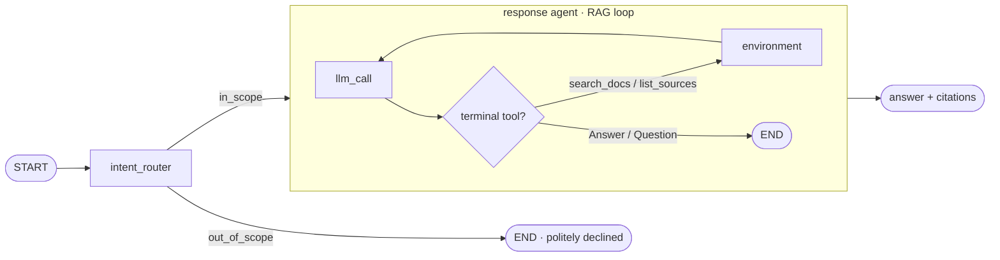

# docagent — agentic RAG over your local documents

**English** | [中文](README.zh-CN.md)

Ask natural-language questions over your own files (Markdown / text / PDF) and get
answers that **always cite their sources**. Built on [LangGraph](https://langchain-ai.github.io/langgraph/).

Unlike a plain single-shot RAG pipeline, docagent runs an **agentic retrieval
loop**: it decides how many times to search, reformulates weak queries, and only
answers once it has gathered enough evidence — through an `Answer` tool that
*forces* citations, so no claim ships ungrounded.

## Features

- 🔁 **Agentic retrieval** — the agent can call `search_docs` several times with
  reformulated queries before it commits to an answer.
- 📎 **Forced citations** — the final answer is produced by an `Answer` tool that
  requires a list of source citations.
- 🧭 **Intent routing** — an up-front router declines out-of-scope questions
  without wasting a retrieval or an answer.
- 🔒 **Local embeddings, no API key** — documents are embedded with
  sentence-transformers locally; only the answer step calls an LLM.
- 🧱 **Clean LangGraph architecture** — a small, readable two-layer state graph
  with tests, evaluation, and CI scaffolding.

## Architecture



## Quickstart

```bash
# 1. Environment (Python 3.11)
conda create -n docagent python=3.11 -c conda-forge
conda activate docagent
pip install -e .

# 2. Configure the answer LLM
cp .env.example .env          # then put your OPENAI_API_KEY in .env
#   (or set LLM_MODEL=ollama:llama3.1 to run fully local)

# 3. Build the knowledge base from the bundled samples
python -m docagent.ingest --path ./sample_docs

# 4. Ask away
python -m docagent.ask "What vector store does docagent use?"
```

Point `--path` at any folder of your own `.md` / `.txt` / `.rst` / `.pdf` files to
build a knowledge base over your own documents. Re-run with `--reset` to rebuild.

## Example run

**Build the knowledge base** from the bundled `sample_docs/`:

```console
$ python -m docagent.ingest --path ./sample_docs --reset
Loading documents from ./sample_docs ...
Loaded 3 raw document section(s).
Split into 6 chunks.
Ingested 6 chunks into collection 'docagent' at ./chroma_db.
Done.
```

**Ask an in-scope question** — the agent retrieves, then answers with citations:

```console
$ python -m docagent.ask "What vector store does docagent use, and do I need an API key for embeddings?"
🔎 Intent: IN_SCOPE — retrieving from knowledge base

=== Answer ===
docagent uses a local persistent Chroma vector store (default `./chroma_db`).
You do not need an API key for embeddings; embeddings are generated locally with
a sentence-transformers model (`all-MiniLM-L6-v2` by default), so the retrieval
half runs fully locally. The answer-generation LLM may require an API key
depending on the provider you choose, but embeddings themselves do not.

=== Citations ===
- faq.md
- architecture.md
- about_docagent.md
```

**Ask an out-of-scope question** — the router declines without wasting a retrieval:

```console
$ python -m docagent.ask "What is the capital of France?"
🚫 Intent: OUT_OF_SCOPE — politely declining

This question is outside the scope of the local knowledge base, so I can't
answer it from the available documents.
```

## How it works

1. **Intent router** classifies the question as `in_scope` or `out_of_scope`
   using an LLM with structured output. Out-of-scope questions end with a polite
   refusal.
2. **Response agent** (in-scope only) runs a tool-calling loop:
   - `search_docs` performs semantic search over the Chroma store;
   - the agent inspects results and may search again with a better query;
   - `Answer(answer, citations)` ends the loop with a grounded, cited answer.

## Project layout

```
src/docagent/
├── agent.py            # LangGraph: intent_router + response-agent RAG loop
├── ingest.py           # CLI: load docs → chunk → embed → Chroma
├── ask.py              # CLI: ask the knowledge base a question
├── vectorstore.py      # shared embeddings + Chroma backend
├── configuration.py    # env-overridable settings
├── prompts.py          # intent + agent prompts
├── schemas.py          # graph state + structured-output schemas
├── tools/
│   ├── base.py         # tool registry
│   └── retrieval_tools.py  # search_docs, list_sources, Answer, Question
└── eval/               # QA dataset + grading prompt
sample_docs/            # demo knowledge base
tests/                  # local retrieval tests + LLM end-to-end tests
```

## Testing

```console
$ python tests/run_all_tests.py          # local retrieval only (no API key)
$ python tests/run_all_tests.py --all    # + LLM end-to-end (needs API key)
...
tests/test_response.py::test_expected_tool_calls[...vector_store...]  PASSED
tests/test_response.py::test_expected_tool_calls[...file_formats...]  PASSED
tests/test_response.py::test_expected_tool_calls[...embeddings...]    PASSED
tests/test_response.py::test_response_criteria[...vector_store...]    PASSED
tests/test_response.py::test_response_criteria[...file_formats...]    PASSED
tests/test_response.py::test_response_criteria[...embeddings...]      PASSED
tests/test_retrieval.py::test_load_sample_documents                   PASSED
tests/test_retrieval.py::test_search_finds_vector_store_fact          PASSED
tests/test_retrieval.py::test_search_finds_file_formats_fact          PASSED
=================== 9 passed ===================
```

- `tests/test_retrieval.py` — ingestion + semantic search over `sample_docs`; **no API key**, also runs in CI.
- `tests/test_response.py` — end-to-end agent: checks the expected tool calls and
  grades answer quality with an LLM (**needs an API key**).

## Configuration

All settings can be set in `.env` (see `.env.example`):

| Variable | Default | Purpose |
|---|---|---|
| `OPENAI_API_KEY` | — | Key for the default OpenAI answer model |
| `LLM_MODEL` | `openai:gpt-4.1` | Any `init_chat_model` id, e.g. `ollama:llama3.1` |
| `EMBEDDING_MODEL` | `sentence-transformers/all-MiniLM-L6-v2` | Local embedding model |
| `CHROMA_PATH` | `./chroma_db` | Vector store directory |
| `CHROMA_COLLECTION` | `docagent` | Collection name |
| `TOP_K` | `4` | Chunks retrieved per search |
| `CHUNK_SIZE` / `CHUNK_OVERLAP` | `1000` / `150` | Ingest chunking |

## Tech stack

LangGraph · LangChain · Chroma · sentence-transformers · pypdf

## License

MIT
