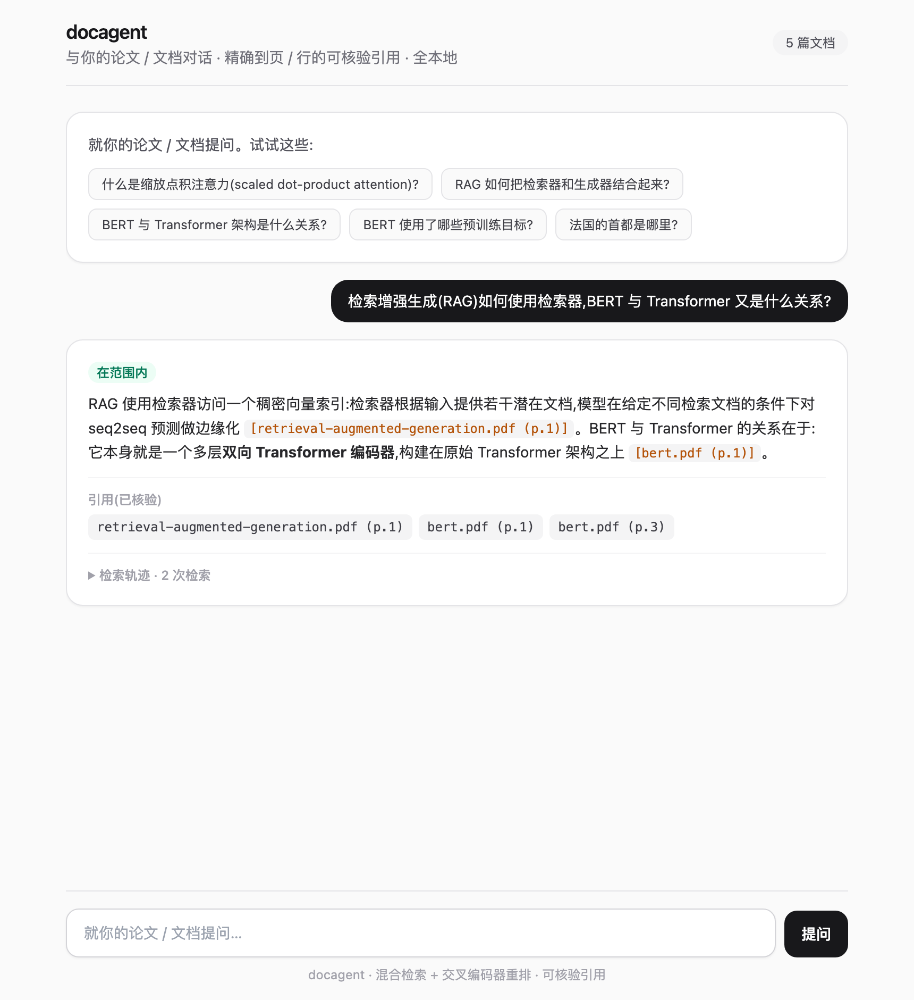
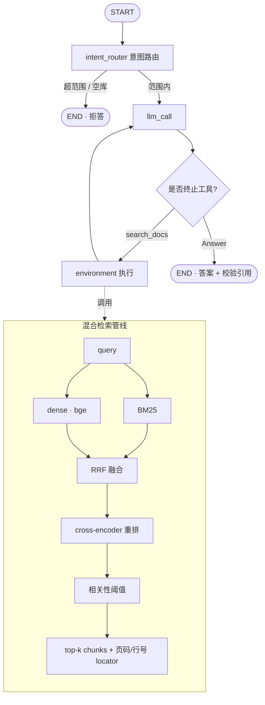

# citelocal-agent — 本地论文研究助手

**中文** | [English](README.en.md)

针对一堆论文(或任意本地文档)提问,得到**精确到页码、且经过校验的引用**答案 —— **全程在本机运行**。基于 [LangGraph](https://langchain-ai.github.io/langgraph/)。

云端论文工具(ChatPDF、Elicit……)要你**上传 PDF**。citelocal-agent 不用:embedding 本地跑,论文不出本机(`papers/` 已 gitignore),作答模型也可用 Ollama 本地跑。返回的答案是有据的 —— 每条引用都对照实际检索内容校验,精确到 **PDF 页码**。

## 凭什么不一样

- 🔒 **全本地 / 隐私** —— PDF 绝不上传;本地 embedding,可选本地 LLM(Ollama)。适合未发表或敏感论文。
- 📎 **精确到页、且校验过的引用** —— 答案引用 `paper.pdf (p.3)`;引用 locator **对照检索校验**,幻觉的会被丢弃。
- 🔗 **跨论文综合** —— agent 自主检索、改写查询、把多篇论文的事实综合进一个答案。
- 🙅 **诚实拒答** —— 论文里没有就说没有(相关性阈值),不编。
- 🧪 **真检索** —— 混合 dense(bge)+ BM25 → RRF → cross-encoder 重排。
- 💬 **CLI + Web UI**、🔭 **检索 trace**、📊 **评估**,多格式(PDF / Markdown / RST / 文本)。

## 快速开始

**一键装机**（用 uv 装好 Python + venv + 依赖，幂等、不覆盖已有 `.env`）：

```bash
./install.sh                       # 装 uv（如缺）→ .venv(3.12) → pip install -e . → 生成 .env
# 编辑 .env 填 OPENAI_API_KEY（或用 OPENAI_BASE_URL 指向任意 OpenAI 兼容网关 / ollama 本地模型）
.venv/bin/citelocal doctor         # 自检：Python / 依赖 / key / 网关连通+模型可用 / 语料
```

装好后用统一的 **`citelocal`** 命令（等价于 `python -m citelocal_agent.<x>`，省去记模块路径）：

```bash
# 拉论文（本地下载，绝不上传）并建索引
python scripts/fetch_arxiv.py --demo          # 8 篇：Attention、RAG、BERT、T5、RoBERTa、DPR、SBERT、GPT-3
#   或：python scripts/fetch_arxiv.py 1706.03762 2005.11401  （任意 arXiv id）
citelocal ingest --path ./papers --reset

citelocal ask --trace "How is BERT related to the Transformer?"
citelocal chat                     # 多轮对话（追问会记住前几轮）
citelocal web                      # Web UI → http://127.0.0.1:8000
```

<details><summary>手动安装（conda / pip）</summary>

```bash
conda create -n citelocal-agent python=3.11 -c conda-forge && conda activate citelocal-agent
pip install -e .            # 之后 citelocal 命令即可用；或继续用 python -m citelocal_agent.<x>
cp .env.example .env        # 填 OPENAI_API_KEY；ollama 本地：pip install -e ".[ollama]"
```
</details>

把 `ingest --path` 指向任意装有你自己 `.pdf` / `.md` / `.rst` / `.txt` 的文件夹即可。

## 运行示例

一个**跨论文**问题 —— agent 检索、列出来源、改写再检索,然后从两篇论文带页码作答(真实输出):

```console
$ python -m citelocal_agent.ask --trace "How does retrieval-augmented generation use a retriever, and how is BERT related to the Transformer architecture?"
🔎 Intent: IN_SCOPE — retrieving from knowledge base
=== trace ===
  1. search_docs  query='retrieval-augmented generation retriever BERT Transformer architecture'
  2. list_sources
  3. search_docs  query='BERT Transformer architecture bidirectional encoder layers'

=== Answer ===
RAG uses a retriever to access a dense vector index … the model marginalizes over
seq2seq predictions given different retrieved documents
[retrieval-augmented-generation.pdf (p.1); retrieval-augmented-generation.pdf (p.2)].
BERT is a multi-layer bidirectional Transformer encoder, based on the original
Transformer [bert.pdf (p.1); bert.pdf (p.3)].

=== Citations ===
- retrieval-augmented-generation.pdf (p.1)
- bert.pdf (p.1)
- bert.pdf (p.3)
```

超范围问题会被拒答;离线时 `python scripts/check_retrieval.py` 可无 key 查看检索栈。

## Web UI



小型聊天前端(FastAPI + 静态 Tailwind),展示答案、意图徽章、引用 chips、被丢弃的未支撑引用、可折叠检索 trace。`python -m citelocal_agent.web` → http://127.0.0.1:8000。

API:
- `POST /api/ask {question, session_id?, collection?}` → `{kind, intent, answer, question, citations, unsupported, trace}`
- `POST /api/ask/stream` —— 同样的请求体,SSE 流式:每个图节点一个 `step` 事件,最后一个 `final` 事件
- `GET /api/sources {collection?}` → `{sources}`;`GET /health` → `{status}`

传 `session_id` 保持多轮对话(按线程 checkpointer),传 `collection` 让一个服务承载多个知识库。
设 `DOCAGENT_API_KEY`(沿用旧包名前缀)后 `/api/*` 需带 `X-API-Key`;`RATE_LIMIT_REQUESTS`/`RATE_LIMIT_WINDOW` 控制按客户端限流。

### Docker

```bash
docker build -t citelocal-agent .
docker run --rm -v $PWD/papers:/papers -v $PWD/chroma_db:/data/chroma citelocal-agent \
  python -m citelocal_agent.ingest --path /papers --reset
docker run -p 8000:8000 -v $PWD/chroma_db:/data/chroma -e OPENAI_API_KEY=sk-... citelocal-agent
```

## 架构



agent 由 `build_agent(config)` 构建 —— import 时不初始化任何模型/reranker;工具绑定到配置好的 retriever(`make_retrieval_tools`)。

## 评估

评估集是一个**带类别标注**的 QA 数据集 `src/citelocal_agent/eval/data/qa_cases.jsonl`(每行一个 JSON)。每行带 `intent`、`category`(`single_paper` / `multi_hop` / `numeric` / `definitional` / `out_of_scope` / `no_answer`)、黄金 `expected_sources`、LLM 评判用的 `criteria`,以及 `split`:

- `offline_sample` —— 答案落在内置 `sample_notes/`,无需下载论文即可跑(离线 LLM 测试用)。
- `full_corpus` —— 需下载 `papers/`,手动 / nightly 评估。

**扩充评测集(生成 → 精校 → 评估):**

```bash
python scripts/fetch_arxiv.py --demo && python -m citelocal_agent.ingest --path ./papers --reset
python scripts/generate_qa.py --n-per-category 25   # 用真实 chunk 让 LLM 起草候选题
#   -> 审阅 src/citelocal_agent/eval/data/generated_raw.jsonl，把好题 curated=true 后并入 qa_cases.jsonl
python -m citelocal_agent.eval.run_eval                    # full_corpus，输出按类别分组的表
python -m citelocal_agent.eval.run_eval --split offline_sample --categories multi_hop
```

`run_eval` **同时输出总体与按类别分组**的所有指标(按类别这一视图,才能证明某次改动是否真有帮助,比如多跳),并写出机器可读的 `eval_results.json` 基线,便于追踪里程碑间的差异。

内置语料现有 **106 篇笔记**(`sample_notes/`),覆盖架构内部、训练、分词、对齐、解码、检索、向量索引、RAG、智能体、评估等细分主题 —— 一个更真实、更难辨别的检索语料。评测集含 **190 条**用例,覆盖 6 个类别(`offline_sample` + 8 篇 demo 论文的 `full_corpus`)。其中 **56 道多跳题**故意需要**同时检索多篇文档**(每题标注 ≥2 个 `expected_sources`),专门考核「一问多文」的检索 + 综合。

下表是一次**全量实测**:`offline_sample` 的**全部 159 条**,跑在仓库自带的 **106 篇 `sample_notes/`** 语料上,reranker 为 **`bge-reranker-v2-m3`**(经[选型实验](docs/reranker-selection.md)定型),答题 + 评判模型为 **`gpt-5.4-mini`**(经 OpenAI 兼容网关)。数字随模型 / 语料变化 —— 换 `LLM_MODEL` 重跑 `run_eval --split offline_sample` 即可复现。(另有 31 条 `full_corpus` 用例需先下载 8 篇 demo 论文,未计入此表。)

| 指标 | 结果 |
|---|---|
| 意图路由准确率 | **99%** (158/159) |
| 检索召回(单次检索) | **0.94** |
| 源覆盖(agent 端到端) | **0.97** |
| 答案正确率(LLM 评判) | **99%** (143/145) |
| 引用准确率(接地) | **92%** (134/145) |
| 拒答准确率 | **93%** (13/14) |
| 幻觉引用 | **1**(此次 run;不同 run 在 0–4 间波动,均落在该拒答的题上) |

> **两个检索指标的区别(重要):** `检索召回` 是对整条复合问题做**一次**检索、看黄金源是否进 top-k;`源覆盖` 是 agent **实际**(含编排把多跳题拆成子问题、逐个检索)这一 run 真正检索到的黄金源占比。后者才反映系统真实能力——多跳题尤其明显(见下)。

按类别:

| 类别 | n | 意图 | 召回 | 覆盖 | 答案 | 引用接地 | 拒答 |
|---|---|---|---|---|---|---|---|
| single_paper | 41 | 1.00 | 0.98 | 1.00 | 1.00 | 0.98 | — |
| definitional | 43 | 1.00 | 0.98 | 1.00 | 1.00 | 0.84 | — |
| multi_hop | 54 | 1.00 | 0.89 | 0.92 | 0.96 | 0.98 | — |
| numeric | 7 | 1.00 | 1.00 | 1.00 | 1.00 | 0.71 | — |
| out_of_scope | 5 | 0.80 | — | — | — | — | 1.00 |
| no_answer | 9 | 1.00 | — | — | — | — | 0.89 |

> **多文档(一问多文)**是重点也是最难的:在 **54 道多跳题**(每题需 ≥2 篇文档)上 —— 引用接地 **0.98**、该类**幻觉引用 0**、答案正确率 **0.96**。检索指标分开看:单次检索召回 **0.89**(严格 all-of:一题所需的**每一段**证据都要命中,非宽松 any-of recall@k,不可与别处横比),agent **端到端源覆盖 0.92**。多跳召回从最初的 0.70 一路抬到 0.89,靠两步:**双阈值门控**(`SCORE_THRESHOLD` 当拒答闸门,闸门开后用更松的 `SUPPORT_THRESHOLD` 纳入低分第二源)+ **换强 reranker**(经[选型实验](docs/reranker-selection.md)定型 `bge-reranker-v2-m3`),全程**拒答行为不变**。

> **已知薄弱点(失败案例,如实记录):** ① 幻觉引用都落在**应当拒答**的 no_answer / out_of_scope 题上(不同 run 0–4 条);② 5 道 out_of_scope 题里有 1 道被误判为 in_scope(意图 0.80,样本小);③ 拒答准确率 0.89/0.93 非满分;④ 引用接地总体 ~0.92,definitional/numeric 偏低(numeric n=7,波动大;`SUPPORT_THRESHOLD=0` 较激进、会纳入弱 chunk,可能稀释引用——属可调项)。详见[失败案例库](docs/failure-cases.md)。

### 真实论文实测(`full_corpus`,8 篇 arXiv PDF)

为回应「只测了合成语料」,在 **8 篇真实 arXiv 论文**(Attention / RAG / BERT / T5 / RoBERTa / DPR / SBERT / GPT-3,共 **989 chunks**、真实 PDF 版式)上跑 `full_corpus` 的 **31 条**(同 `bge-reranker-v2-m3` + `gpt-5.4-mini`):

| 指标 | 结果 |
|---|---|
| 意图路由准确率 | **100%** (31/31) |
| 检索召回(单次检索) | **0.93** |
| 源覆盖(agent 端到端) | **1.00** |
| 答案正确率(LLM 评判) | **96%** (26/27) |
| 引用准确率(接地) | **100%** (27/27) |
| 拒答准确率 | **100%** (4/4) |
| 幻觉引用 | **0** |

复现:`python scripts/fetch_arxiv.py --demo` → `citelocal ingest --path ./papers --reset` → `python -m citelocal_agent.eval.run_eval --split full_corpus`。

> **诚实读法(别把小样本当定论):** full_corpus 只有 **31 条**(单源 19、多跳仅 **2**、拒答类各 2)——上面的 100% 是**方向性**信号,不是统计证明;多跳 n=2 召回 0.50(即 1/2)、numeric 0.75(3/4),更只是轶事。真实论文上**0 幻觉、引用接地 100%、端到端覆盖 1.00** 是可信的好兆头,但样本量需扩充才能下结论。
>
> **PDF 解析局限(评审点名「公式/表格表现未知」,如实说):** 当前用 `pypdf` 做**纯文本**抽取,**表格 / 公式 / 多栏版式会被拍平**成文本流(只保留页码 locator)。上面的 QA 多由文本 chunk 生成、属**正文可答**,所以这套数字**尚未**真正考核表格 / 公式 / 扫描版论文——那仍是**已知盲区**,列入后续(换版面感知的 PDF 解析)。

## 目录结构

```
src/citelocal_agent/
├── agent.py            # LangGraph 工厂：intent_router + 应答循环 + trace
├── retriever.py        # 混合检索：dense+BM25 -> RRF -> 重排 -> 阈值
├── ingest.py           # 加载 -> 切块(带页码/行号出处) -> 向量化 -> Chroma
├── ask.py / web.py     # CLI / FastAPI + 静态 Web UI
├── cli.py / doctor.py  # 统一 `citelocal` 命令 + 安装/配置自检
├── tools/              # make_retrieval_tools + make_web_tools(可选); Answer, Question
├── utils.py            # extract_outcome()：引用校验
└── eval/               # data/qa_cases.jsonl(数据集) + qa_dataset.py(加载器) + run_eval.py
scripts/                # fetch_arxiv.py · generate_qa.py · check_retrieval.py · calibrate_threshold.py · rerank_bakeoff.py
sample_notes/           # 内置离线语料（CI / 快速试，无需下载）
tests/                  # test_unit.py（离线）+ test_retrieval.py + test_response.py
```

## 测试

```bash
python tests/run_all_tests.py          # 离线检索测试（无需 key）
python tests/run_all_tests.py --all    # + LLM 端到端（需 key + 已 ingest 论文）
```

CI 跑 ruff、mypy、离线单测(无网络/模型)、`sample_notes` 上的检索测试、以及「wheel 是否打包 UI」冒烟。

开发 / 接入真实模型 / 评测过程中的问题与解决方案,见 [工程踩坑记录](docs/engineering-notes.md)。

## 配置

`.env`(见 `.env.example`):`OPENAI_API_KEY`、`LLM_MODEL`(默认 `openai:gpt-4.1`;任意 `init_chat_model` id,含 `ollama:llama3.1`)、`EMBEDDING_MODEL`(`BAAI/bge-small-en-v1.5`)、`RERANKER_MODEL`(默认 `BAAI/bge-reranker-v2-m3`,见[选型实验](docs/reranker-selection.md);本地 CPU 较慢,可换 `cross-encoder/ms-marco-MiniLM-L-6-v2` 提速)、`TOP_K`/`CANDIDATE_K`、`SCORE_THRESHOLD`(拒答闸门,默认 0.2,已校准,见 `scripts/calibrate_threshold.py`)、`SUPPORT_THRESHOLD`(闸门开后纳入支持性 chunk 的更松阈值,默认 0.0;设为等于 `SCORE_THRESHOLD` 即关闭)、`CHROMA_PATH`/`CHROMA_COLLECTION`。

### 联网搜索工具（可选，默认关闭）

项目默认「本地优先」。设 `ENABLE_WEB_SEARCH=1` 后,agent 在同一个工具循环里**自主选择**本地文档检索还是联网:文档不足/需时效外部事实时,它会调 `web_search` → `fetch_url`。关键是**引用同样可验证** —— 网页结果带 `web:<url>` locator,经与文档完全相同的 `retrieved_locators`/`evidence` 通道校验:引用了没真正抓取过的 URL 会被移入 `unsupported`。启用后意图路由新增 `web_answerable` 档,让「文档外但网上能查」的问题也能进入 agent(纯闲聊仍拒答)。

```bash
pip install -e ".[web]"                      # 免密钥 DuckDuckGo 后端
ENABLE_WEB_SEARCH=1 python -m citelocal_agent.ask "<文档外、网上可查的问题>"
# 可选更高质量后端(需 TAVILY_API_KEY):
# pip install -e ".[tavily]" && ENABLE_WEB_SEARCH=1 WEB_SEARCH_BACKEND=tavily ...
```

`WEB_SEARCH_BACKEND`(`ddg`默认/`tavily`)、`WEB_SEARCH_RESULTS`、`WEB_FETCH_CHARS` 可调。默认关闭时工具集、路由、离线 CI 与原来完全一致。

## 技术栈

LangGraph · LangChain · Chroma · sentence-transformers (bge) · rank-bm25 · cross-encoder · pypdf · FastAPI · Tailwind

## 许可证

MIT。Demo 论文是本地从 arXiv 下载的,**未**在本仓库再分发,版权归原作者。
