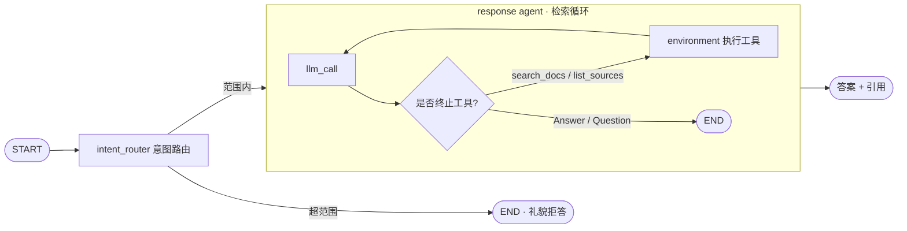

# docagent — 面向本地文档的 agentic RAG 问答

[English](README.md) | **中文**

针对你自己的文件(Markdown / 文本 / PDF)用自然语言提问,得到**始终带来源引用**的答案。基于 [LangGraph](https://langchain-ai.github.io/langgraph/) 构建。

与「检索一次就生成」的普通 RAG 不同,docagent 跑的是 **agentic 检索循环**:由 agent 自己决定检索几次、在结果不佳时改写查询,直到收集到足够证据才作答 —— 并且通过一个 `Answer` 工具**强制附带引用**,杜绝无依据的回答。

## 特性

- 🔁 **Agentic 检索** —— agent 可以用改写后的查询多次调用 `search_docs`,再决定作答。
- 📎 **强制引用** —— 最终答案由 `Answer` 工具产出,该工具要求必须给出来源引用列表。
- 🧭 **意图路由** —— 前置路由先判断问题是否在知识库范围内,超范围的直接礼貌拒答,不浪费检索和作答。
- 🔒 **本地 embedding、无需 API key** —— 文档用 sentence-transformers 在本地做向量化,只有「作答」这一步才调用 LLM。
- 🧱 **清晰的 LangGraph 架构** —— 一个小而可读的两层状态图,配套测试、评估与 CI。

## 架构



## 快速开始

```bash
# 1. 环境（Python 3.11）
conda create -n docagent python=3.11 -c conda-forge
conda activate docagent
pip install -e .

# 2. 配置作答 LLM
cp .env.example .env          # 然后把 OPENAI_API_KEY 填进 .env
#   （或设 LLM_MODEL=ollama:llama3.1 完全本地运行）

# 3. 用自带示例文档建立知识库
python -m docagent.ingest --path ./sample_docs

# 4. 开始提问
python -m docagent.ask "What vector store does docagent use?"
```

把 `--path` 指向任意一个装有你自己的 `.md` / `.txt` / `.rst` / `.pdf` 文件的目录,即可针对自己的文档建库。加 `--reset` 可重建。

## 运行示例

**建立知识库**(使用自带的 `sample_docs/`):

```console
$ python -m docagent.ingest --path ./sample_docs --reset
Loading documents from ./sample_docs ...
Loaded 3 raw document section(s).
Split into 6 chunks.
Ingested 6 chunks into collection 'docagent' at ./chroma_db.
Done.
```

**提一个范围内的问题** —— agent 先检索,再带引用作答:

```console
$ python -m docagent.ask "What vector store does docagent use, and do I need an API key for embeddings?"
🔎 Intent: IN_SCOPE — retrieving from knowledge base

=== Answer ===
docagent uses a local persistent Chroma vector store (default `./chroma_db`).
You do not need an API key for embeddings; embeddings are generated locally with
a sentence-transformers model (`all-MiniLM-L6-v2` by default), so the retrieval
half runs fully locally. The answer-generation LLM may require an API key
depending on the provider you choose, but embeddings themselves do not.

=== Citations ===
- faq.md
- architecture.md
- about_docagent.md
```

**提一个超范围的问题** —— 路由直接拒答,不浪费检索:

```console
$ python -m docagent.ask "What is the capital of France?"
🚫 Intent: OUT_OF_SCOPE — politely declining

This question is outside the scope of the local knowledge base, so I can't
answer it from the available documents.
```

## 工作原理

1. **意图路由(intent_router)** 用带结构化输出的 LLM 把问题判为 `in_scope` 或 `out_of_scope`;超范围的以礼貌拒答结束。
2. **应答 agent(response_agent)**(仅范围内)跑一个工具调用循环:
   - `search_docs` 在 Chroma 上做语义检索;
   - agent 检查结果,必要时用更好的查询再搜一次;
   - `Answer(answer, citations)` 以一个有依据、带引用的答案结束循环。

## 目录结构

```
src/docagent/
├── agent.py            # LangGraph：intent_router + 应答 agent 检索循环
├── ingest.py           # CLI：加载文档 → 切块 → 向量化 → 写入 Chroma
├── ask.py              # CLI：向知识库提问
├── vectorstore.py      # 共享的 embedding + Chroma 后端
├── configuration.py    # 可被环境变量覆盖的配置
├── prompts.py          # 意图 / agent 提示词
├── schemas.py          # 图状态 + 结构化输出 schema
├── tools/
│   ├── base.py         # 工具注册中心
│   └── retrieval_tools.py  # search_docs, list_sources, Answer, Question
└── eval/               # QA 数据集 + 评分提示词
sample_docs/            # 示例知识库
tests/                  # 本地检索测试 + LLM 端到端测试
```

## 测试

```console
$ python tests/run_all_tests.py          # 仅本地检索（无需 API key）
$ python tests/run_all_tests.py --all    # + LLM 端到端（需要 API key）
...
tests/test_response.py::test_expected_tool_calls[...vector_store...]  PASSED
tests/test_response.py::test_expected_tool_calls[...file_formats...]  PASSED
tests/test_response.py::test_expected_tool_calls[...embeddings...]    PASSED
tests/test_response.py::test_response_criteria[...vector_store...]    PASSED
tests/test_response.py::test_response_criteria[...file_formats...]    PASSED
tests/test_response.py::test_response_criteria[...embeddings...]      PASSED
tests/test_retrieval.py::test_load_sample_documents                   PASSED
tests/test_retrieval.py::test_search_finds_vector_store_fact          PASSED
tests/test_retrieval.py::test_search_finds_file_formats_fact          PASSED
=================== 9 passed ===================
```

- `tests/test_retrieval.py` —— 针对 `sample_docs` 的索引 + 语义检索;**无需 API key**,CI 中也会跑。
- `tests/test_response.py` —— 端到端 agent:检查预期的工具调用,并用 LLM 给答案质量打分(**需要 API key**)。

## 配置

所有配置都可在 `.env` 中设置(见 `.env.example`):

| 变量 | 默认值 | 用途 |
|---|---|---|
| `OPENAI_API_KEY` | — | 默认 OpenAI 作答模型的 key |
| `LLM_MODEL` | `openai:gpt-4.1` | 任意 `init_chat_model` id,如 `ollama:llama3.1` |
| `EMBEDDING_MODEL` | `sentence-transformers/all-MiniLM-L6-v2` | 本地 embedding 模型 |
| `CHROMA_PATH` | `./chroma_db` | 向量库目录 |
| `CHROMA_COLLECTION` | `docagent` | collection 名称 |
| `TOP_K` | `4` | 每次检索返回的 chunk 数 |
| `CHUNK_SIZE` / `CHUNK_OVERLAP` | `1000` / `150` | 索引切块参数 |

## 技术栈

LangGraph · LangChain · Chroma · sentence-transformers · pypdf

## 许可证

MIT
